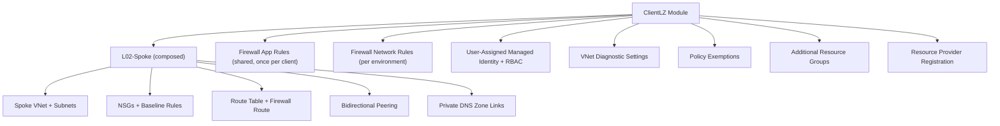

# ClientLZ — Client Landing Zone

## Overview

**Composite/orchestration module** that wraps L02-Spoke and adds client-specific capabilities: resource provider registration, additional resource groups, Azure Firewall rule collection groups, User-Assigned Managed Identity with RBAC, VNet diagnostic settings, and policy exemptions. This is the primary module used to onboard new client environments.

**Module path:** `modules/ClientLZ/`

> **Uses three aliased providers:** `azurerm.spoke` (spoke subscription), `azurerm.hub` (hub subscription for firewall rules and DNS zone roles), and the default provider.

## Architecture



## Resources Created

| Resource | Mode | Description |
|----------|------|-------------|
| `azurerm_resource_provider_registration.spoke` | for_each | Resource providers in spoke subscription |
| `module "spoke"` (L02-Spoke) | 1 | Full spoke VNet deployment |
| `azurerm_resource_group.additional` | for_each | Additional RGs (e.g. AMA RG) |
| `azurerm_firewall_policy_rule_collection_group.application` | count 0–1 | Shared application firewall rules |
| `azurerm_firewall_policy_rule_collection_group.network` | count 0–1 | Per-environment network firewall rules |
| `azurerm_resource_group.uami` | count 0–1 | UAMI resource group |
| `azurerm_user_assigned_identity.this` | count 0–1 | User-Assigned Managed Identity |
| `azurerm_role_assignment.uami_network_contributor` | count 0–1 | Network Contributor on subnet |
| `azurerm_role_assignment.uami_dns_zone_contributor` | for_each | Private DNS Zone Contributor (multiple zones) |
| `azurerm_monitor_diagnostic_setting.vnet_primary` | count 0–1 | VNet diagnostics to monitoring LAW |
| `azurerm_monitor_diagnostic_setting.vnet_additional` | for_each | Additional VNet diagnostics |
| `azurerm_resource_policy_exemption.vnet_primary/additional` | count/for_each | Policy exemptions for TF-managed diagnostics |

## Inputs

### Client Identity (Required)

| Variable | Type | Description |
|----------|------|-------------|
| `client_name` | `string` | Human-readable name (e.g. "CluedIn") |
| `client_prefix` | `string` | Short prefix (e.g. "cln"), 2–10 chars |
| `environment_key` | `string` | Short env (e.g. "dev", "prod") |
| `environment_name` | `string` | Full env: Development/Test/Staging/Production |

### ALZ Baseline (Required)

| Variable | Type | Description |
|----------|------|-------------|
| `root_id` / `location` | `string` | Core infrastructure references |
| `hub_vnet_id` / `hub_vnet_name` / `hub_resource_group_name` | `string` | Hub VNet references |
| `firewall_private_ip` | `string` | Azure Firewall IP |
| `firewall_policy_id` | `string` | Firewall policy for rule collection groups |
| `log_analytics_workspace_id` | `string` | LAW for spoke diagnostics |

### Network (Required)

| Variable | Type | Description |
|----------|------|-------------|
| `address_space` | `list(string)` | Primary VNet CIDRs |
| `subnets` | `map(object)` | Subnet definitions |

### Firewall Rules

| Variable | Type | Default | Description |
|----------|------|---------|-------------|
| `deploy_firewall_rules` | `bool` | `true` | Master toggle |
| `deploy_shared_firewall_app_rules` | `bool` | `false` | Deploy shared app rules (ONCE per client) |
| `firewall_app_rules` | `list(object)` | `[]` | Application rules (FQDNs + protocols) |
| `firewall_network_rules` | `list(object)` | `[]` | Network rules (IPs + ports) |
| `firewall_app_rule_priority` / `firewall_network_rule_priority` | `number` | 400 / 401 | Rule collection group priorities |

### Managed Identity

| Variable | Type | Default | Description |
|----------|------|---------|-------------|
| `deploy_managed_identity` | `bool` | `false` | UAMI toggle |
| `uami_network_contributor_subnet_key` | `string` | `"aks"` | Subnet for Network Contributor role |
| `uami_dns_zone_names` | `set(string)` | 9 zones | DNS zones for auto RBAC |

### Diagnostics & Policy

| Variable | Type | Default | Description |
|----------|------|---------|-------------|
| `deploy_vnet_monitor_diagnostics` | `bool` | `false` | VNet diagnostics to monitoring LAW |
| `deploy_policy_exemptions` | `bool` | `false` | Policy exemptions for TF-managed diagnostics |
| `policy_assignment_id` | `string` | `""` | Policy assignment to exempt |

## Outputs

| Output | Description |
|--------|-------------|
| `resource_group_name` / `vnet_id` / `vnet_name` / `subnet_ids` / `nsg_ids` / `route_table_id` | Passthrough from L02-Spoke |
| `peering_spoke_to_hub_id` / `peering_hub_to_spoke_id` | Peering IDs |
| `firewall_app_rule_collection_group_id` / `firewall_network_rule_collection_group_id` | Firewall rule group IDs |
| `managed_identity` | UAMI: {id, principal_id, client_id} or null |
| `additional_resource_group_ids` | Map of additional RG IDs |

## How to Use in the Orchestrator

ClientLZ is the **primary module for onboarding client environments**. Each client environment (dev, prod, test) gets its own ClientLZ instance with a dedicated provider.

### Full Example: Dev Environment

```hcl
module "client_<client>_dev" {
  source = "git::https://github.com/samirbelkessa/Landing-Zone.git//Terraform-Azure-LZ/modules/ClientLZ?ref=main"

  # ── Client Identity ──
  client_name      = var.client_name                  # e.g. "CluedIn"
  client_prefix    = var.client_prefix                # e.g. "cln"
  environment_key  = "dev"
  environment_name = "Development"

  # ── ALZ Baseline ──
  root_id                            = var.root_id
  location                           = var.default_location
  hub_vnet_id                        = local.spoke_common.hub_vnet_id
  hub_vnet_name                      = local.spoke_common.hub_vnet_name
  hub_resource_group_name            = local.spoke_common.hub_resource_group_name
  firewall_private_ip                = local.spoke_common.firewall_private_ip
  firewall_policy_id                 = var.deploy_connectivity ? module.firewall_global_policy[0].id : ""
  log_analytics_workspace_id         = local.spoke_common.log_analytics_workspace_id
  log_analytics_workspace_guid       = try(module.m01_log_analytics[0].workspace_id, null)
  log_analytics_workspace_region     = var.default_location
  monitor_log_analytics_workspace_id = try(module.m01_log_analytics_monitor[0].id, "")

  # ── Spoke Network (all from variables — no hardcoded CIDRs) ──
  address_space = var.spokes["dev"].address_space
  instance      = var.spokes["dev"].instance
  subnets       = var.spokes["dev"].subnets

  # ── Routing ──
  use_remote_gateways           = var.enable_vpn_gateway
  allow_gateway_transit         = var.enable_vpn_gateway
  udr_subnet_keys               = ["aks", "jmp"]
  disable_bgp_route_propagation = true
  custom_default_route_name     = "toDefault"

  # ── Security ──
  enable_baseline_nsg_rules  = false
  bastion_subnet_prefix      = local.spoke_common.bastion_subnet_prefix
  bastion_target_subnet_keys = ["aks", "jmp"]
  base_nsg_rules             = local.nsg_experteq_base_rules

  # ── DNS ──
  private_dns_zone_links = local.spoke_common_dns_zone_links

  # ── Firewall Rules ──
  deploy_shared_firewall_app_rules = true     # ONLY on first environment!
  firewall_app_rule_priority       = var.firewall_app_rule_priority
  firewall_network_rule_priority   = var.firewall_network_rule_priority_dev
  firewall_app_rules               = lookup(var.client_firewall_app_rules, var.client_prefix, [])
  firewall_network_rules           = var.firewall_network_rules_dev

  # ── UAMI ──
  deploy_managed_identity             = true
  uami_network_contributor_subnet_key = "aks"

  # ── Diagnostics & Policy ──
  deploy_vnet_monitor_diagnostics            = var.deploy_m01_log_analytics_monitor
  deploy_additional_vnet_monitor_diagnostics = var.deploy_m01_log_analytics_monitor
  deploy_policy_exemptions                   = var.deploy_m01_log_analytics_monitor
  policy_assignment_id                       = azurerm_management_group_policy_assignment.deploy_diag_settings_law.id

  # ── Flow Logs ──
  enable_vnet_flow_logs        = var.deploy_spoke_vnet_flow_logs
  flow_logs_storage_account_id = var.deploy_spoke_vnet_flow_logs ? azurerm_storage_account.flow_logs[0].id : ""
  enable_traffic_analytics     = var.flow_logs_enable_traffic_analytics

  # ── Resource Provider Registration ──
  enable_resource_provider_registration = true

  # ── Tags ──
  tags = local.spoke_common.tags

  depends_on = [
    module.alz_connectivity,
    azurerm_firewall_policy_rule_collection_group.default_network,
    azurerm_firewall_policy_rule_collection_group.default_application,
    module.private_dns_zone_fabric,
  ]

  providers = {
    azurerm.spoke = azurerm.client_<env>
    azurerm.hub   = azurerm.connectivity
  }
}
```

### Second Environment (Prod)

```hcl
module "client_<client>_prod" {
  source = "git::https://github.com/samirbelkessa/Landing-Zone.git//Terraform-Azure-LZ/modules/ClientLZ?ref=main"

  client_name      = var.client_name
  client_prefix    = var.client_prefix
  environment_key  = "prod"
  environment_name = "Production"

  # Same ALZ baseline as dev...
  # Different network CIDRs — all from variables
  address_space = var.spokes["prod"].address_space
  instance      = var.spokes["prod"].instance
  subnets       = var.spokes["prod"].subnets

  # ── KEY DIFFERENCE: Shared firewall app rules NOT deployed here ──
  deploy_shared_firewall_app_rules = false    # Already deployed by dev instance
  firewall_network_rule_priority   = var.firewall_network_rule_priority_prod
  firewall_network_rules           = var.firewall_network_rules_prod

  # ── No VPN gateway transit in prod ──
  use_remote_gateways   = false
  allow_gateway_transit  = false

  # ── UAMI not needed for prod ──
  deploy_managed_identity = false

  depends_on = [module.alz_connectivity, module.client_<client>_dev]    # Depends on dev (shared rules)

  providers = {
    azurerm.spoke = azurerm.client_<env>
    azurerm.hub   = azurerm.connectivity
  }
}
```

### Options Guide

| Option | When to change | Impact |
|--------|---------------|--------|
| `deploy_shared_firewall_app_rules = true` | First environment of a client | Deploys shared app rules (ONCE per client) |
| `deploy_shared_firewall_app_rules = false` | Subsequent environments | Avoids duplicate firewall rules |
| `deploy_managed_identity = true` | AKS needs UAMI for DNS/network | Creates UAMI + RBAC (Network Contributor + DNS zones) |
| `deploy_firewall_rules = false` | No firewall rules needed | Skips all firewall rule collection groups |
| `enable_vnet_flow_logs = true` | Network traffic logging | VNet flow logs to storage |
| `deploy_vnet_monitor_diagnostics = true` | Dual-LAW pattern | VNet diagnostics to Monitor LAW |
| `deploy_policy_exemptions = true` | Terraform-managed diagnostics | Exempt VNet from Azure Policy (Mitigated) |
| `additional_vnets = {...}` | Multi-VNet spoke | Extra VNets with independent peering |
| `firewall_network_rule_priority` | Multiple clients | Unique priority per client env (avoid collision) |

## Dependencies

- **Upstream:** AVM Connectivity (hub VNet, firewall), M01 (LAW), C14 (firewall policy), F01 (root_id)
- **Downstream:** None (terminal module for client environments)

## Implementation Notes

- **Composition module:** Wraps L02-Spoke via Git source reference, adds client-specific resources around it
- **Firewall rule split:** Shared app rules (once per client) + per-environment network rules (prevents duplication)
- **NSG rule merging:** `local.merged_nsg_rules` combines base rules + environment-specific rules
- **UAMI DNS zone scopes** auto-computed from zone names and merged with manual scopes
- **Policy exemptions** mark VNet diagnostics as "Mitigated" to prevent Azure Policy conflicts with TF-managed settings
- **`depends_on = [azurerm_resource_provider_registration.spoke]`** ensures providers registered before resource creation
